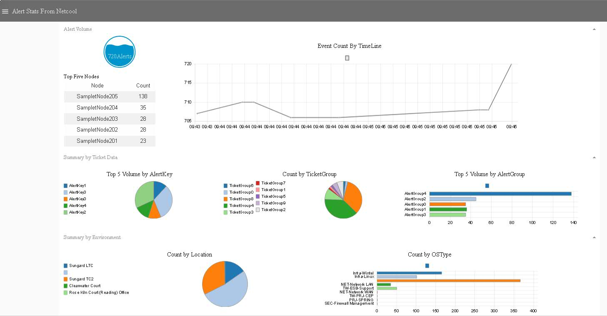
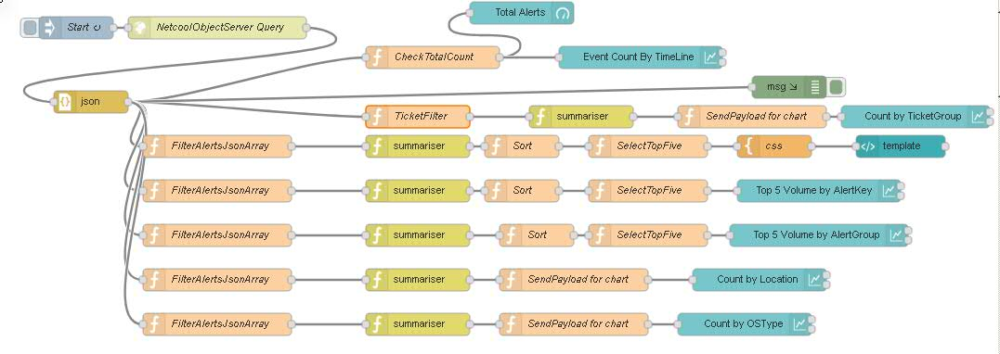

# netcool-NodeRed-Dashboard

This solution provides a jazzy real-time dashboard to the user community for understanding alert trending pattern in detail. Health widgets in this monitoring dashboard will provide an overall health status and insight of alert categories which contributed more. 

Key at dashboard
- Gauges for alert categories
- Aggregate the top contributed alerts
- Real-time graph of alarm count along with timeline

Alert normalization used as below, before implementing please ensure whether this normalization is applicable for target environment. 
If not, do replace the flow file with respective field before importing to node-red.


Dashboard :
----------
 

## Implementation Steps:

### Step 1: Enable Http Interface at Object server
- To enable the interfaces, set the NRestOS.Enable property to TRUE.
- To configure the embedded HTTP server so that the interfaces are active on an HTTP port, specify the listening port for the connection type. For example, to make the interfaces listen on port 8080, set the properties as follows:

```
NHttpd.EnableHTTP : TRUE
NHttpd.ListeningPort : 8080

```
- If you want the interfaces to be active on an HTTPS port on 9090, set the properties that are shown in the following example. HTTPS port is SSL encrypted and a certificate file that contains an appropriate certificate needs to be created and protected with a password.
```
NHttpd.SSLEnable : TRUE
NHttpd.SSLListeningPort : 9090
NHttpd.SSLCertificate : “certificatelabel”
NHttpd.SSLCertificatePwd : “password”

```
### Step 2: Install Node.js,node-red and node-red dashboard module at linux desktop/Server
- The commands to install required node-red platform to host this dashboard solution
```
curl --silent --location https://rpm.nodesource.com/setup_9.x | sudo bash -
yum install -y nodejs
yum install gcc-c++ make
/bin/npm install -g --unsafe-perm node-red
npm i node-red-dashboard --save
```

### Step 3: Securing Node-red dashboard
- There are couple of authentication mechanism available to make dashboard (1.http static id 2.twitter and git hub Oauth services) secure please refer to below link to implement.
   https://nodered.org/docs/security 
   
### Step 4: Import the dashboardFlow.json
- Login to the flow editor using url https://localhost:1880/red 
- Import the dashboardFlow.json using option available at top right corner.
- Once imported flow will look like below content.

  #### Flow post import on node-red flow editor:
     
- Edit the [NetcoolObjectServer Query] Node to feed in Netcool omnibus Http access url and credentials.
  (Please do verify from browser, before feed data to this while accessing it must return a object server alert data on browser)
  
  ### Step 5: Accessing dashboard
  - You can access the dashboard via url http://localhost:1880/ui/#/0
  
## Production Scenarios were this dashboard can be used
  
- Lighter version solution for alert data visualization.
- Critical care application monitoring dashboard
- Command centre single status console summary.
